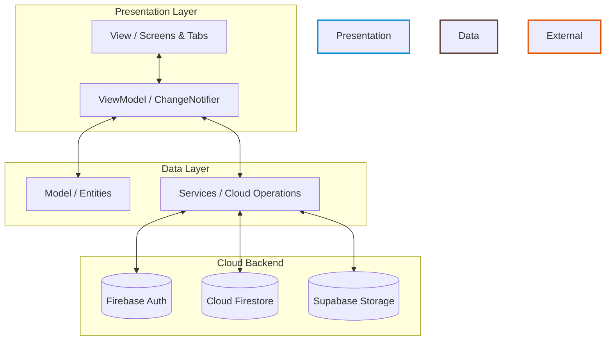
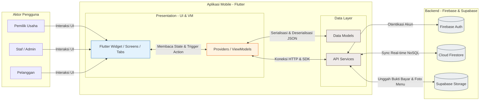

# Dokumen Arsitektur Perangkat Lunak
## Sistem Informasi Point of Sales (POS) & Manajemen Warung "Mpo Lemezz"

Dokumen ini mendeskripsikan arsitektur perangkat lunak dari aplikasi **Mpo Lemezz App** yang dikembangkan menggunakan **Flutter** untuk perangkat mobile, serta terintegrasi dengan layanan cloud **Firebase** (Authentication & Firestore Database) dan **Supabase Storage** (Penyimpanan Media/Gambar).

Arsitektur ini dirancang untuk mewujudkan fungsionalitas sistem yang ditunjukkan dalam diagram alir data dan modul operasional warung (Manajemen User, Master Data, Manajemen Inventaris, Manajemen Produksi, Manajemen Penjualan, Manajemen Penggajian, Pengelolaan Operasional, dan Pengelolaan Laporan).

---

## 1. Pola Arsitektur Utama: Clean Architecture & MVVM (Model-View-ViewModel)

Aplikasi dibangun menggunakan pola arsitektur **Clean Architecture** yang dikombinasikan dengan **MVVM (Model-View-ViewModel)** untuk pemisahan fungsionalitas (Separation of Concerns). Struktur kode dibagi ke dalam tiga layer utama:

1. **Presentation Layer (View & ViewModel)**: Bertanggung jawab atas tampilan antarmuka (UI) dan logika interaksi pengguna. State management dikelola menggunakan **Provider** (`ChangeNotifier`).
2. **Data Layer (Model & Services)**: Bertanggung jawab atas pengelolaan data, konversi data dari Firestore (`fromFirestore` / `toFirestore`), dan komunikasi dengan cloud service (Firebase/Supabase).
3. **Core Layer (Constants, Utilities, Theme)**: Menyediakan konfigurasi umum, tema aplikasi, dan utilitas pendukung seperti lokalisasi bahasa (translator).

### Diagram Hubungan MVVM & Cloud Service


---

## 2. Struktur Direktori Proyek (Package Structure)

Penerapan arsitektur Clean MVVM tecermin dalam struktur direktori `lib/` sebagai berikut:

```text
lib/
├── core/                       # Layer Inti / Konfigurasi Global
│   ├── constants/             # Konstanta Aplikasi (e.g., app_constants.dart)
│   ├── theme/                 # Desain Tema & Warna (e.g., app_theme.dart, app_colors.dart)
│   └── utils/                 # Utilitas Pendukung (e.g., translator.dart)
│
├── data/                       # Layer Data
│   ├── models/                # Objek Data / Entitas Database
│   │   ├── user_model.dart
│   │   ├── food_item_model.dart
│   │   ├── order_model.dart
│   │   ├── raw_ingredient_model.dart
│   │   └── shop_settings_model.dart
│   └── services/              # Layanan Eksternal & Integrasi API
│       └── inventory_service.dart
│
└── presentation/               # Layer Tampilan (Presentation Layer)
    ├── auth/                  # Modul Autentikasi & Login
    │   ├── screens/
    │   └── viewmodels/        # auth_viewmodel.dart
    ├── customer/              # Modul Portal Pelanggan
    │   ├── screens/
    │   └── viewmodels/        # customer_viewmodel.dart
    ├── admin/                 # Modul Portal Staf Produksi, Penjualan & Gudang
    │   ├── screens/
    │   │   ├── tabs/          # admin_home_tab.dart, admin_stock_tab.dart, admin_reports_tab.dart
    │   │   └── admin_main_screen.dart
    │   └── viewmodels/        # admin_view_model.dart
    └── owner/                 # Modul Portal Pemilik Usaha
        ├â”## 3. Implementasi Arsitektur Berdasarkan Diagram Modul

Berikut adalah detail bagaimana setiap komponen fungsional pada Diagram Arsitektur Fungsional Sistem diimplementasikan di dalam kode aplikasi Flutter Anda saat ini:

### A. Pendaftaran
Modul ini mengontrol autentikasi pengguna berdasarkan peran (role-based access control) untuk **Pemilik Usaha (Owner)**, **Staf / Admin (Staff)**, dan **Pelanggan (Customer)**.
* **Input**: Registrasi, Kredensial Akun, Data Profil Pengguna.
* **Proses**: Pendaftaran akun baru, verifikasi kredensial login melalui Firebase Authentication, serta penentuan peran (`role`) pengguna.
* **Output**: `Token Otentifikasi` (state token login aktif), `Hak Akses` (penentuan dashboard sesuai role), `Profil Pengguna Aktif`.
* **Berkas Kode Terkait**:
  * Model: [user_model.dart](file:///d:/Kuliah%20Farhan/Semester%208/Skripsi%20TA/GadoGado_App/lib/data/models/user_model.dart)
  * ViewModel: [auth_viewmodel.dart](file:///d:/Kuliah%20Farhan/Semester%208/Skripsi%20TA/GadoGado_App/lib/presentation/auth/viewmodels/auth_viewmodel.dart)
  * View/Screen: [login_screen.dart](file:///d:/Kuliah%20Farhan/Semester%208/Skripsi%20TA/GadoGado_App/lib/presentation/auth/screens/login_screen.dart), [register_screen.dart](file:///d:/Kuliah%20Farhan/Semester%208/Skripsi%20TA/GadoGado_App/lib/presentation/auth/screens/register_screen.dart)

### B. Pemesanan & Pembayaran
Memproses transaksi pesanan dari katalog menu hingga pembayaran mandiri atau validasi kasir.
* **Input**: Opsi Item Menu, Tipe Layanan (Dine In, Take Away, atau Delivery), Bukti Transfer.
* **Proses**: Pemrosesan pesanan, perhitungan total tagihan otomatis, serta pengunggahan gambar struk transfer ke cloud storage.
* **Output**: `Kalkulasi Pembayaran`, `Transaksi Cloud DB`, `Nota Digital` (E-Receipt), `Catatan Pesanan`.
* **Berkas Kode Terkait**:
  * Model: [order_model.dart](file:///d:/Kuliah%20Farhan/Semester%208/Skripsi%20TA/GadoGado_App/lib/data/models/order_model.dart)
  * ViewModel: [admin_view_model.dart](file:///d:/Kuliah%20Farhan/Semester%208/Skripsi%20TA/GadoGado_App/lib/presentation/admin/viewmodels/admin_view_model.dart) (Metode `updateOrderStatus()`)
  * View/Screen: [admin_order_details_screen.dart](file:///d:/Kuliah%20Farhan/Semester%208/Skripsi%20TA/GadoGado_App/lib/presentation/admin/screens/admin_order_details_screen.dart)

### C. Pengiriman & Ongkos Kirim
Menghitung ongkos kirim pesanan secara otomatis berdasarkan jarak GPS pelanggan.
* **Input**: Alamat Fisik Pengiriman, Status Progress Kurir.
* **Proses**: Estimasi jarak pengantaran berbasis Geolocator GPS koordinat dan pelacakan status kurir.
* **Output**: `Jarak Pengantaran`, `Biaya Ongkir` (ongkos kirim berdasarkan jarak).
* **Berkas Kode Terkait**:
  * Model Pengiriman: [order_model.dart](file:///d:/Kuliah%20Farhan/Semester%208/Skripsi%20TA/GadoGado_App/lib/data/models/order_model.dart) (Field: `latitude`, `longitude`, `deliveryAddress`, `deliveryFee`)
  * Layanan GPS: Integrasi geolocator & geocoding pada aplikasi Flutter.

### D. Manajemen Stok Bahan Baku
Memantau pasokan bahan baku di dapur secara real-time dan melakukan pemotongan otomatis.
* **Input**: Update Stok Masuk (restok), Komposisi Resep Menu, Ambang Batas Minimum.
* **Proses**: Pengurangan stok bahan baku secara otomatis di Firestore setelah transaksi selesai, serta deteksi stok di bawah ambang batas minimum.
* **Output**: `Logistik Bahan Baku`, `Potong Stok Otomatis`, `Notifikasi Stok Kritis` (real-time alert).
* **Berkas Kode Terkait**:
  * Model Bahan Baku: [raw_ingredient_model.dart](file:///d:/Kuliah%20Farhan/Semester%208/Skripsi%20TA/GadoGado_App/lib/data/models/raw_ingredient_model.dart)
  * ViewModel: [admin_view_model.dart](file:///d:/Kuliah%20Farhan/Semester%208/Skripsi%20TA/GadoGado_App/lib/presentation/admin/viewmodels/admin_view_model.dart)
  * View/Screen: [admin_stock_tab.dart](file:///d:/Kuliah%20Farhan/Semester%208/Skripsi%20TA/GadoGado_App/lib/presentation/admin/screens/tabs/admin_stock_tab.dart)

### E. Manajemen Menu
Mengelola menu makanan dan minuman yang aktif dan ditampilkan pada aplikasi.
* **Input**: Detail Menu Baru, Kategori Menu, Harga Hidangan, Unggah Gambar Menu.
* **Proses**: Input menu makanan baru, penentuan kategori menu, serta penyimpanan file gambar menu ke Supabase Storage.
* **Output**: `Katalog Menu Aktif`, `Informasi Harga & Detail Menu`.
* **Berkas Kode Terkait**:
  * Model Menu: [food_item_model.dart](file:///d:/Kuliah%20Farhan/Semester%208/Skripsi%20TA/GadoGado_App/lib/data/models/food_item_model.dart)
  * View/Screen: [add_menu_screen.dart](file:///d:/Kuliah%20Farhan/Semester%208/Skripsi%20TA/GadoGado_App/lib/presentation/admin/screens/add_menu_screen.dart)

### F. Laporan Penjualan
Menyediakan grafik keuangan dan rekapitulasi penjualan untuk kebutuhan analisis bisnis.
* **Input**: Riwayat Transaksi, Data Omset Harian.
* **Proses**: Query agregasi dan pengolahan statistik penjualan mingguan/bulanan dari koleksi Firestore.
* **Output**: `Grafik Omset Per-Minggu`, `Laporan Penjualan` (omset dan diagram hidangan terlaris).
* **Berkas Kode Terkait**:
  * View/Screen: [admin_reports_tab.dart](file:///d:/Kuliah%20Farhan/Semester%208/Skripsi%20TA/GadoGado_App/lib/presentation/admin/screens/tabs/admin_reports_tab.dart), [owner_history_tab.dart](file:///d:/Kuliah%20Farhan/Semester%208/Skripsi%20TA/GadoGado_App/lib/presentation/owner/screens/tabs/owner_history_tab.dart)

---

## 4. Diagram Arsitektur Komponen Sistem (System Component Diagram)

Berikut adalah diagram alir data arsitektural dari input pengguna hingga penyimpanan cloud:



---

## 5. Hubungan Koleksi Database Firestore (Entity Relationship Mapping)

Untuk mendukung modul-modul di atas, database Cloud Firestore diorganisasikan ke dalam skema koleksi berikut:

1. **`users` (Koleksi)**
   * Berhubungan dengan **Pendaftaran**.
   * Field: `id` (UID dari Auth), `name`, `email`, `phone`, `role` (Admin/Owner/Customer), `profilePic`.
2. **`ingredients` (Koleksi)**
   * Berhubungan dengan **Manajemen Stok Bahan Baku**.
   * Field: `id`, `name`, `category`, `amount` (stok fisik), `unit` (kg/pcs/gram), `minStockThreshold`.
3. **`menu` (Koleksi)**
   * Berhubungan dengan **Manajemen Menu**.
   * Field: `id`, `name`, `description`, `price`, `category`, `imageUrl`, `isAvailable`.
4. **`orders` (Koleksi)**
   * Berhubungan dengan **Pemesanan & Pembayaran**, **Pengiriman & Ongkos Kirim**, dan **Laporan Penjualan**.
   * Field: `id`, `customerId`, `items` (Array of FoodItem & Quantity), `totalAmount`, `serviceType` (dineIn/takeAway/delivery), `status` (pending/preparing/ready/completed/finished), `paymentMethod`, `paymentProofUrl`, `rating`, `timestamp`, `completedAt`, `latitude`, `longitude`, `deliveryAddress`, `deliveryFee`.
5. **`settings` (Koleksi)**
   * Berhubungan dengan **Pengoperasian Warung** (Status Warung Buka/Tutup/Ishoma).
   * Dokumen: `shop_status` -> Field: `status` (open/ishoma/closed), `lastUpdated`.

---

## Kesimpulan

Arsitektur aplikasi **Mpo Lemezz** sangat selaras dengan diagram yang Anda lampirkan. Melalui kombinasi **Flutter (MVVM + Provider)** dan **Firebase/Supabase**, aplikasi ini mampu memproses input dari berbagai aktor secara real-time, menyimpannya secara terstruktur di database Cloud Firestore, dan menghasilkan keluaran info operasional maupun grafik laporan yang akurat secara instan pada antarmuka pengguna.ini mampu memproses input dari berbagai aktor secara real-time, menyimpannya secara terstruktur di database Cloud Firestore, dan menghasilkan keluaran info operasional maupun grafik laporan yang akurat secara instan pada antarmuka pengguna.
