# 🥗 Warung Mpo Lemez - POS & Inventory Management System

> **Warung Mpo Lemez App** adalah aplikasi Point of Sale (POS) dan Manajemen Inventaris Bahan Baku real-time berbasis mobile multi-role (*Pelanggan*, *Admin / Kasir*, dan *Owner*). Dirancang dengan arsitektur **MVVM (Model-View-ViewModel)** yang bersih, responsif, dan terintegrasi dengan ekosistem cloud modern.

<p align="center">
  
  
  
  
  
  
  
  
  
  
</p>

---

## 📱 Preview & Showcase

<p align="center">
  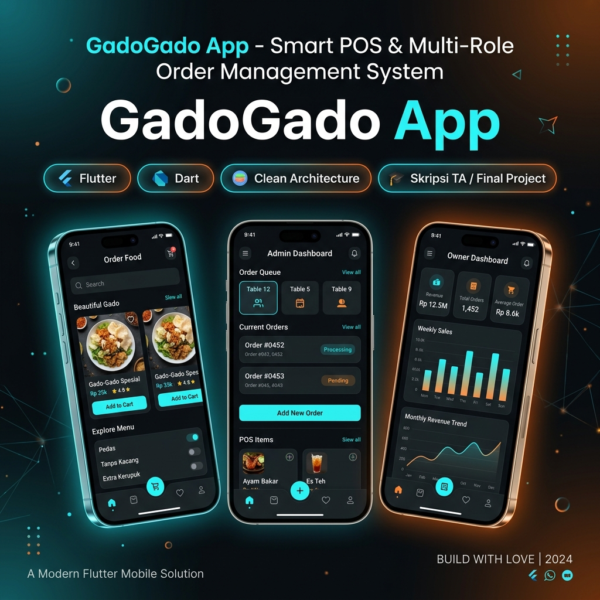
</p>

<br />

<p align="center">
  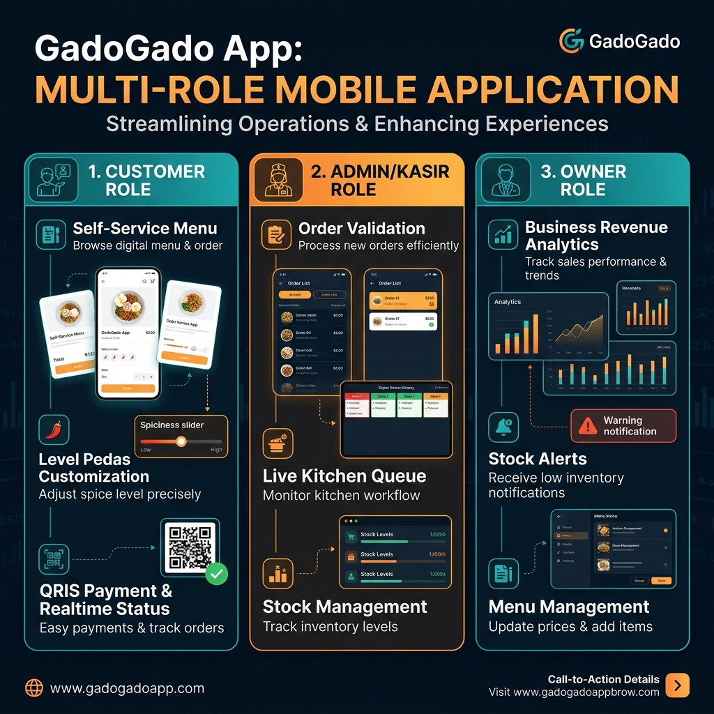
</p>

---

## 📌 Project Metadata

| Informasi | Keterangan |
| :--- | :--- |
| **Nama Aplikasi** | **Warung Mpo Lemez - POS & Inventory System** |
| **Deskripsi** | Solusi digitalisasi F&B untuk otomatisasi pemesanan, validasi kasir, kontrol stok bahan baku, dan pelaporan laba/rugi eksekutif. |
| **Aktor Pengguna** | 3 Peran: **Pelanggan** (Customer), **Admin / Kasir** (Cashier), **Owner** (Pemilik Bisnis) |
| **Pengembang** | **Muhammad Farhan Aprilianto** |
| **Pola Arsitektur** | **Clean Architecture + MVVM** (*Model-View-ViewModel*) |
| **State Management** | **Provider** (`ChangeNotifierProvider`) |
| **Backend & Database**| **Firebase Firestore, Firebase Auth, Firebase Storage & Supabase** |
| **Bahasa & Framework**| **Dart & Flutter SDK (>= 3.x)** |
| **Repository URL** | [github.com/MuhammadFarhanAprilianto/GadoGado_App](https://github.com/MuhammadFarhanAprilianto/GadoGado_App) |

---

## 🌟 Fitur Utama Berdasarkan Peran

```text
========================================================================================
                               WARUNG MPO LEMEZ ECOSYSTEM
========================================================================================
  [ PELANGGAN ]                 [ ADMIN / KASIR ]                 [ OWNER ]
  ├── 🛒 Katalog Menu            ├── 📋 Antrean Pesanan Live       ├── 📊 Dashboard Finansial
  ├── 📝 Kustomisasi Order       ├── ✅ Validasi Pembayaran         ├── 📈 Grafik Omset & Laba
  ├── 💳 QRIS & Tunai            ├── 📦 Manajemen Stok Bahan       ├── 📑 Ekspor PDF Laporan
  ├── ⏱️ Tracking Status Live    ├── 🍲 Kelola Menu & Harga        ├── ⚠️ Alert Restock Supplier
  └── 🧾 Struk Digital Dinamis   └── 🧾 Rekap Harian Kasir         └── 👥 Manajemen Resep Bahan
========================================================================================
```

### 1. 🛍️ Modul Pelanggan (*Customer Experience*)
- **Katalog Menu Interaktif**: Jelajahi hidangan utama (Gado-Gado, Karedok, Ketoprak), minuman, dan menu pendukung lengkap dengan foto, deskripsi, dan harga.
- **Pemesanan Mandiri Dinamis**: Pengaturan porsi, tingkat kepedasan, serta catatan khusus untuk setiap pesanan.
- **Multi-Payment Gateway**: Mendukung pembayaran via **QRIS Dinamis** maupun pembayaran langsung di kasir.
- **Live Order Tracking**: Pantau status pesanan secara *real-time* dari status **Menunggu Konfirmasi**, **Sedang Dimasak**, **Siap Disajikan**, hingga **Selesai**.
- **Struk Digital & Riwayat**: Akses e-receipt digital dan riwayat transaksi kapan saja tanpa perlu mencetak kertas fisik.

### 2. ⚡ Modul Admin / Kasir (*Operational Efficiency*)
- **Manajemen Antrean Pesanan**: Dashboard pesanan masuk dengan indikator status dan waktu pemesanan.
- **Validasi Pembayaran Instan**: Verifikasi pembayaran tunai dan pembayaran digital QRIS dalam satu sentuhan.
- **Kontrol Persediaan Bahan Baku**: Input pemakaian bahan harian, restock bahan, dan pemantauan stok menipis secara otomatis.
- **CRUD Menu & Kategori**: Tambah, ubah harga, update gambar, dan nonaktifkan menu yang habis secara langsung.
- **Rekapitulasi Shift Kasir**: Ringkasan transaksi harian untuk pencocokan uang fisik dan digital.

### 3. 📈 Modul Pemilik (*Executive Business Intelligence*)
- **Dashboard Finansial Interaktif**: Visualisasi pendapatan, total transaksi, dan rata-rata penjualan menggunakan grafik interaktif (**FL Chart**).
- **Analisis Laba/Rugi & Omset**: Laporan omset kotor, pengeluaran bahan baku, dan estimasi laba bersih periodik (harian, mingguan, bulanan).
- **Cetak & Ekspor Laporan PDF**: Pembuatan laporan penjualan formal berstandar profesional yang dapat diunduh atau langsung dicetak (**Printing & PDF Package**).
- **Early Warning System (Stok Kritis)**: Notifikasi visual ketika persediaan bahan baku berada di bawah batas minimum (*safety stock*).

---

## 📸 Galeri Antarmuka (*Screenshots Showcase*)

### 🛒 Tampilan Pelanggan (*Customer UI*)
| Beranda & Menu | Pemesanan Menu | Pembayaran QRIS | Status Pesanan | Struk Digital |
| :---: | :---: | :---: | :---: | :---: |
| 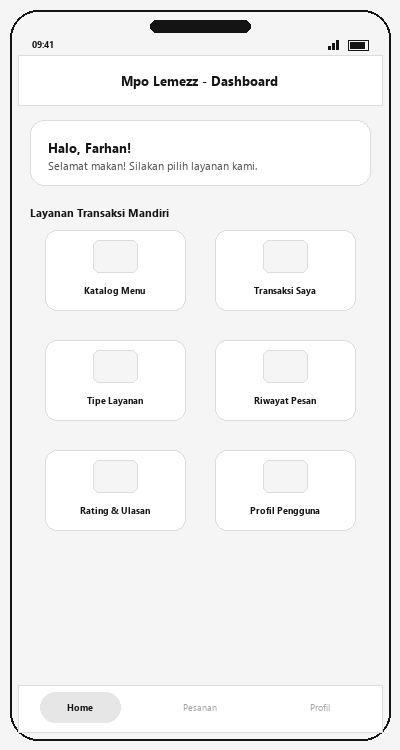 | 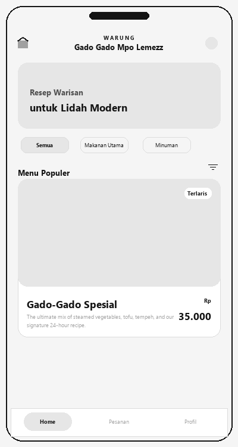 | 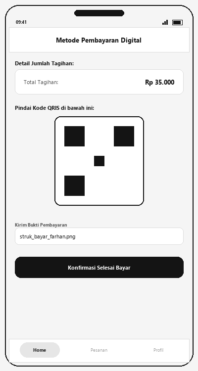 | 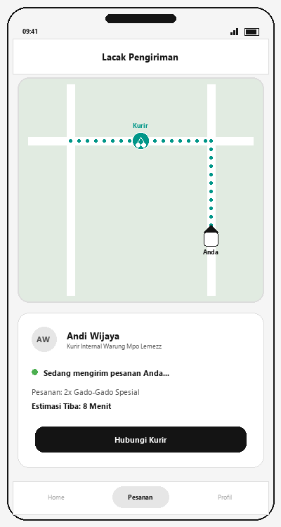 | 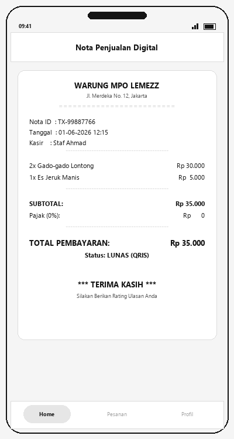 |

### ⚡ Tampilan Admin & Kasir (*Admin UI*)
| Dashboard Admin | Menu Kasir / POS | Validasi Pembayaran | Rekap Penjualan |
| :---: | :---: | :---: | :---: |
| 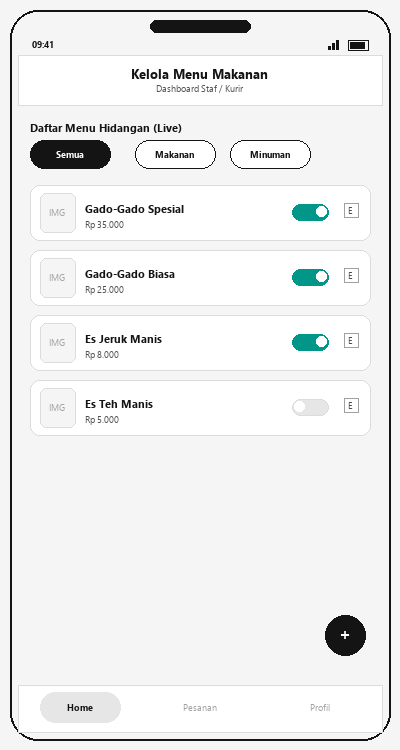 | 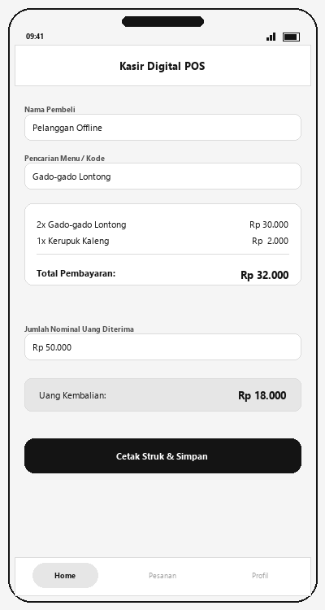 | 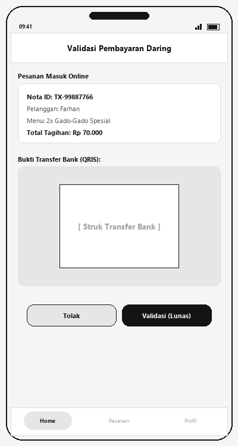 | 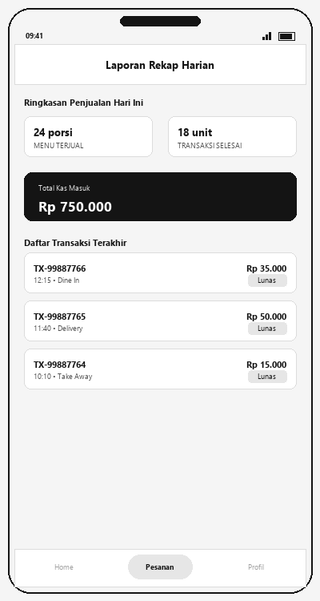 |

### 📊 Tampilan Pemilik (*Owner UI*)
| Dashboard Finansial | Grafik Analisis Omset | Manajemen Bahan Baku | Alert Stok Menipis |
| :---: | :---: | :---: | :---: |
| 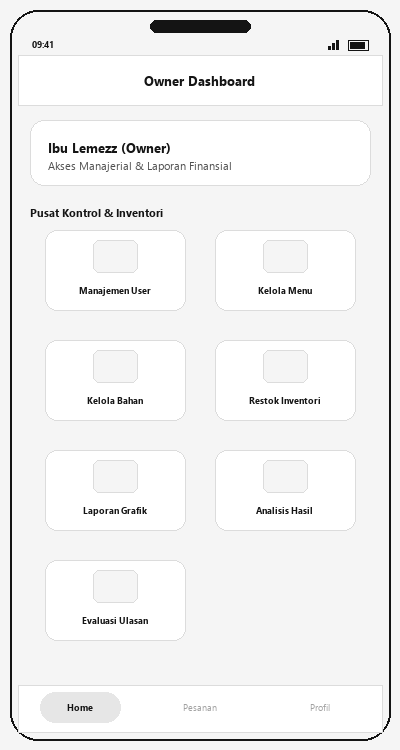 | 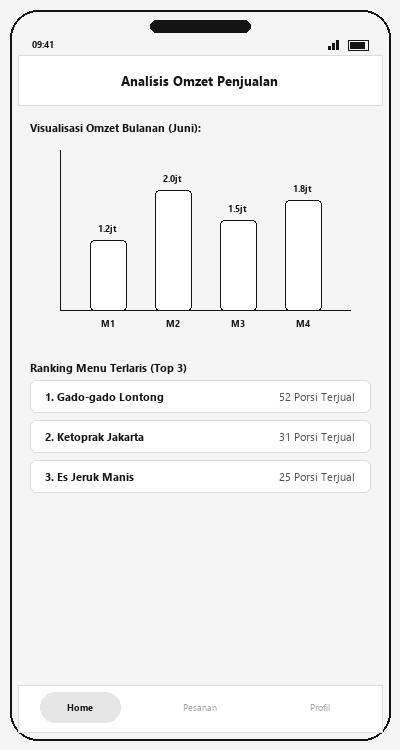 | 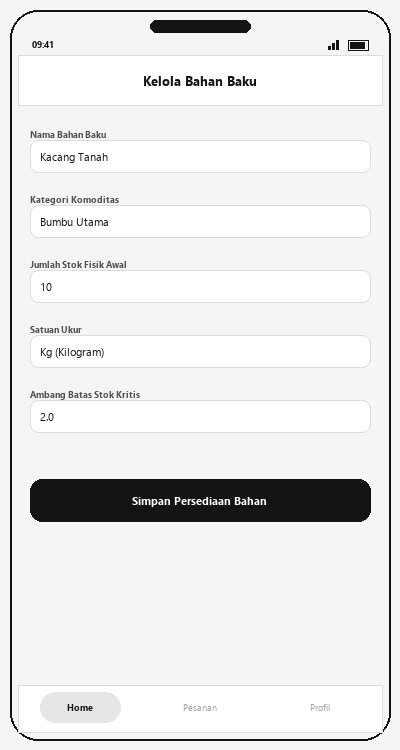 | 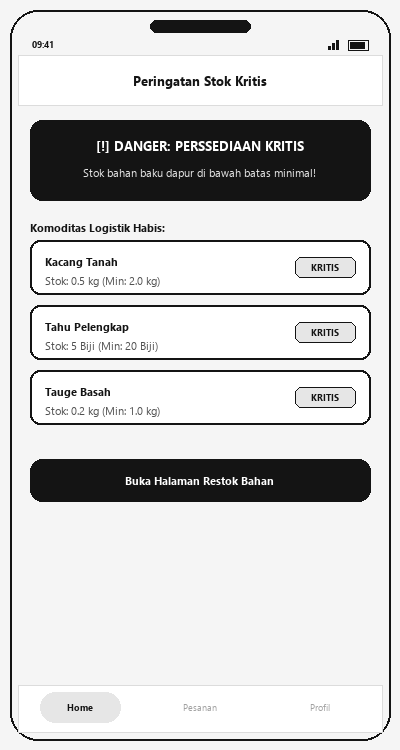 |

---

## 🏛 Arsitektur Sistem & Struktur Folder

Proyek ini menerapkan prinsip **Clean Architecture & MVVM (Model - View - ViewModel)** dengan pemisahan tanggung jawab (*Separation of Concerns*) yang ketat:

```text
GadoGado_App/
├── database/                     # Aset Skema, Dataset, & Security Rules Database
│   ├── collections_json/         # Master data awal & JSON collections Firestore
│   ├── sql_schema/               # DDL Relational Schema (PostgreSQL / Supabase / MySQL)
│   ├── security_rules/           # Firestore Security Rules & Supabase Storage RLS
│   └── Kamus_Data_dan_Struktur_Database.md # Kamus data atribut & tipe data
├── docs/                         # Dokumentasi Proyek & Naskah Skripsi
│   ├── diagrams/                 # Diagram UML, Use Case, Activity, Sequence, ERD, Arsitektur
│   ├── poster/                   # Poster Skripsi & Asset Gambar
│   ├── screenshots/              # Screenshot antarmuka aplikasi
│   └── skripsi/                  # Draft naskah Bab I - VII & materi seminar
├── assets/                       # Aset multimedia aplikasi Flutter
│   └── images/                   # Gambar menu makanan, logo, & QRIS
└── lib/                          # Source Code Utama (Clean Architecture & MVVM)
    ├── core/                     # Konfigurasi dasar, tema Material 3, & utilitas
    │   ├── constants/            # Konstanta aplikasi & role
    │   ├── theme/                # Sistem warna & AppTheme
    │   └── utils/                # PDF Generator, Formatter, Translator
    ├── data/                     # Data layer
    │   ├── models/               # Data Transfer Objects (User, FoodItem, Order, Stock)
    │   └── services/             # Firebase, Supabase, & Inventory Service API
    └── presentation/             # Presentation layer (UI Screens & ViewModels)
        ├── auth/                 # Autentikasi (Login, Register, Role Detection)
        ├── customer/             # Antarmuka & Logika Pelanggan (Home, Cart, Status)
        ├── admin/                # Antarmuka Kasir & Admin (Antrean, Validasi, Menu)
        ├── owner/                # Antarmuka Pemilik (Dashboard Omset, Stock Alert)
        └── widgets/              # Reusable UI Widgets (Card, Button, Dialog)
```

---

## 🛠️ Tech Stack & Pustaka Utama

- **Framework**: [Flutter](https://flutter.dev/) & [Dart SDK](https://dart.dev/)
- **State Management**: [Provider](https://pub.dev/packages/provider)
- **Cloud Backend & Database**: 
  - [Cloud Firestore](https://firebase.google.com/docs/firestore) & [Firebase Auth](https://firebase.google.com/docs/auth)
  - [Supabase Flutter](https://supabase.com/)
- **Charts & Data Visualization**: [FL Chart](https://pub.dev/packages/fl_chart)
- **PDF & Document Printing**: [pdf](https://pub.dev/packages/pdf) & [printing](https://pub.dev/packages/printing)
- **QR Code Engine**: [qr_flutter](https://pub.dev/packages/qr_flutter)
- **Location & Geocoding**: [google_maps_flutter](https://pub.dev/packages/google_maps_flutter), [geolocator](https://pub.dev/packages/geolocator)
- **Typography & Icons**: [Google Fonts](https://pub.dev/packages/google_fonts), [Font Awesome](https://pub.dev/packages/font_awesome_flutter), [Cupertino Icons](https://pub.dev/packages/cupertino_icons)

---

## 🚀 Panduan Memulai (*Getting Started*)

### 1. Prasyarat
Pastikan environment Anda telah terpasang:
- [Flutter SDK](https://docs.flutter.dev/get-started/install) (Versi `>= 3.11` disarankan)
- [Android Studio](https://developer.android.com/studio) atau [VS Code](https://code.visualstudio.com/) dengan ekstensi Flutter & Dart
- Git

### 2. Kloning Repositori
```bash
git clone https://github.com/MuhammadFarhanAprilianto/GadoGado_App.git
cd GadoGado_App
```

### 3. Konfigurasi Lingkungan (*Environment*)
Salin template konfigurasi dan sesuaikan nilai kredensial:
```bash
cp .env.example .env
```

### 4. Instal Dependensi
```bash
flutter pub get
```

### 5. Jalankan Aplikasi

#### Opsi A: Menggunakan Docker (Rekomendasi untuk Lab Kampus / Tanpa Setup SDK)
```bash
# Jalankan container web app
docker compose up -d

# Akses di web browser:
# http://localhost:8080

# Menjalankan automated test suite di dalam Docker:
docker compose --profile test run --rm test
```
> 📖 Baca panduan lengkap deployment lab di [DOCKER_GUIDE.md](DOCKER_GUIDE.md).

#### Opsi B: Menggunakan Flutter CLI Lokal
```bash
# Mode Debug pada perangkat/emulator yang terhubung
flutter run
```

---

## 🔐 Keamanan & Kebijakan Privasi

- **Zero Hardcoded Secrets**: Seluruh kredensial sensitif, keystore, dan konfigurasi privat dilindungi melalui `.gitignore`.
- **Role-Based Access Control (RBAC)**: Pembatasan hak akses ketat antara Pelanggan, Kasir, dan Pemilik untuk menjaga integritas data operasional dan keuangan.

---

## 👨‍💻 Pengembang

**Muhammad Farhan Aprilianto**  
*Informatics Engineering Student & Software Developer*  
- **GitHub**: [@MuhammadFarhanAprilianto](https://github.com/MuhammadFarhanAprilianto)
- **Portfolio Website**: [farhanaprilianto.my.id](https://farhanaprilianto.my.id/) *(atau tautan portofolio Anda)*

---

## 📄 Lisensi

Proyek ini didistribusikan di bawah lisensi **MIT License**. Silakan lihat berkas `LICENSE` untuk rincian lebih lanjut.

<p align="center">
  <b>Warung Mpo Lemez App &copy; 2026. Crafted with ❤️ using Flutter.</b>
</p>
